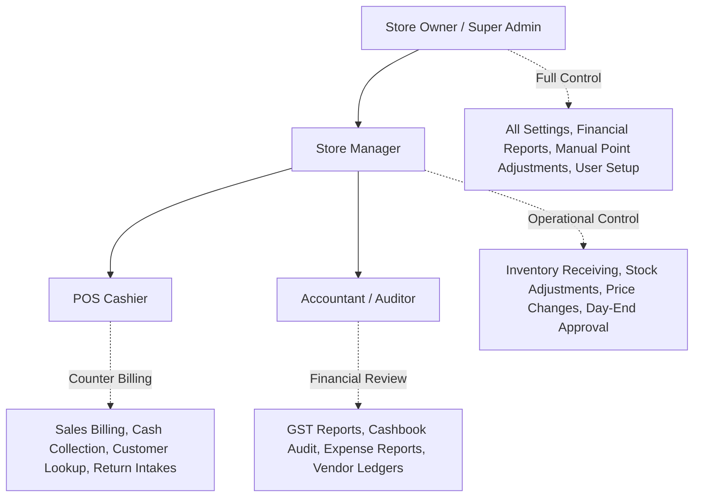
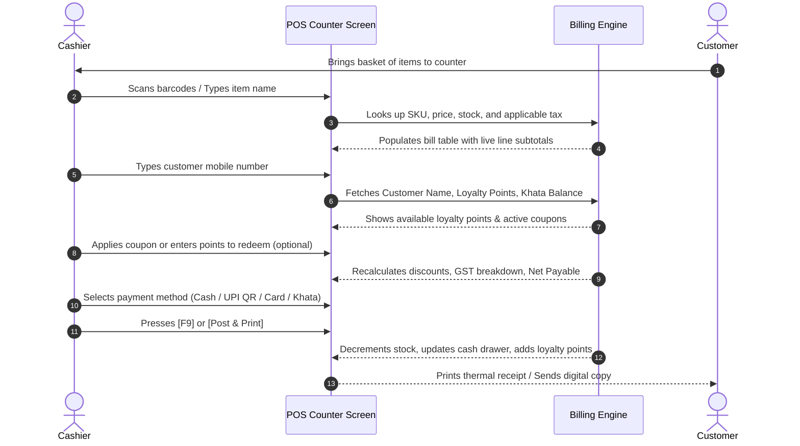
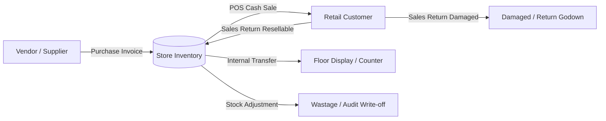
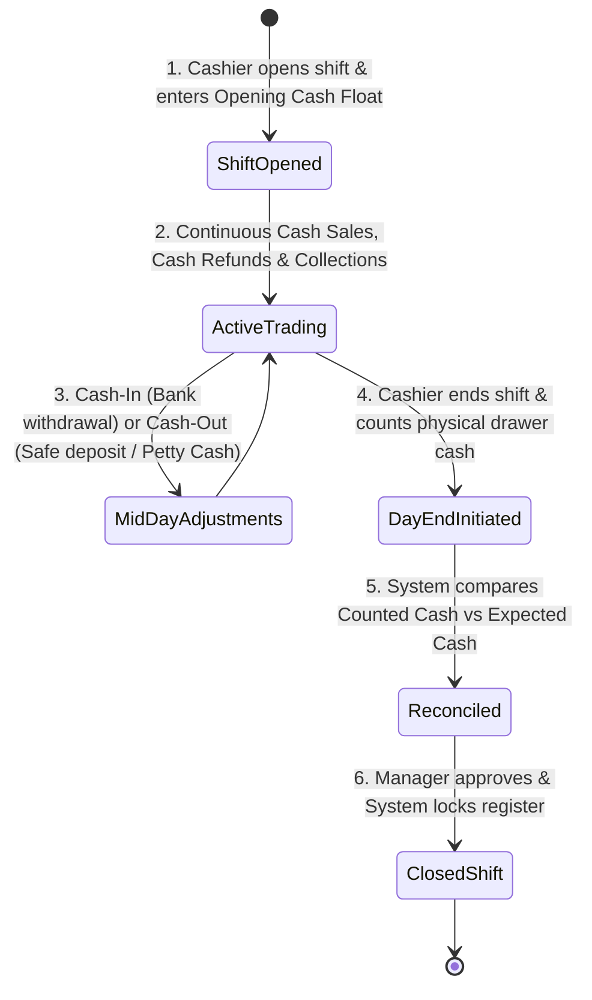

# RS Inventory – Solo: Comprehensive Functional Specification & Business User Guide

**Product**: RS Inventory – Solo  
**Publisher**: RS ORANGE TECH PVT LTD  
**Edition**: Solo (Offline-First Single Store Edition)  
**Target Market**: Retail Outlets, Supermarkets, Kirana Stores, Boutiques, Electronics, Hardware & Wholesale-Retail in India  
**Compliance**: Indian GST (CGST, SGST, IGST, Cess), GSTR-1, GSTR-3B Ready  

---

## 1. Executive Product Overview

### 1.1 Purpose and Mission
**RS Inventory – Solo** is a standalone, high-performance desktop application engineered specifically for retail shop owners, store managers, and cashiers across India. In contrast to cloud-based POS systems that slow down during network fluctuations or become unusable during broadband outages, RS Inventory – Solo is **100% offline-first**. 

Every transaction, barcode scan, invoice generation, customer credit update, and inventory count happens instantaneously on the local PC without requiring an active internet connection.

### 1.2 Core Business Value Pillars
1. **Speed at the Checkout Counter**: Barcode-driven scanning, smart hotkeys, and sub-second receipt printing keep checkout lines moving rapidly even during peak festive rush.
2. **Complete Cash & Register Accountability**: Eliminates cash drawer discrepancies through formal shift openings, mid-day drops, automated cashbook entries, and strict Day-End Closing reconciliations.
3. **Built-in Digital Khata (Customer Credit)**: Replaces physical paper notebooks with a reliable ledger that tracks customer outstandings, enforces credit limits, and sends payment reminders.
4. **Retention & Repeat Sales Engine**: Features an integrated Customer Loyalty Points Wallet and Promotional Coupon Management system that turns one-time walk-in shoppers into loyal repeat buyers.
5. **Statutory Tax & GST Readiness**: Generates GST-compliant B2B and B2C tax invoices with automated HSN summaries, multi-tier tax calculations, and exportable GSTR-1 summaries.
6. **Ironclad Data Ownership**: All business records, customer contact databases, and sales numbers reside safely on the shop owner’s local computer, fully immune to cloud server downtimes or external subscription lockouts.

---

## 2. User Personas & Role-Based Access Control

RS Inventory – Solo enforces role-based access control (RBAC) to ensure employees only perform actions appropriate for their job responsibilities:



### 2.1 Roles & Responsibilities

| Role | Primary User | Key Capabilities & Functional Boundaries |
| :--- | :--- | :--- |
| **Store Owner / Admin** | Proprietor, Director | Full access to business financial statements, profit margins, company profile, tax configuration, user account creation, manual loyalty point adjustments, and system backups. |
| **Store Manager** | Store In-charge, Floor Lead | Manages product catalog, approves goods received from suppliers, oversees stock transfers and write-offs, reviews day-end closing discrepancies, and issues promotional coupons. |
| **Cashier** | Counter Billing Staff | Rapidly scans items at POS, collects payments (Cash, UPI, Card, Khata), redeems coupons/loyalty points, issues next-bill coupons, and performs physical cash counts at shift close. Restrained from modifying past invoices, changing purchase rates, or deleting inventory masters. |
| **Accountant** | In-house / External Tax Preparer | Generates GSTR-1 and GSTR-3B tax summaries, reconciles supplier payments, reviews the chronological cashbook, monitors operating expenses, and tracks customer credit aging. |

---

## 3. Master Catalog & Store Setup

Before opening the store for daily sales, the system provides unified catalogs to define all operating parameters.

### 3.1 Product Master (Goods & Services)
Every item sold or stocked is configured with precise trade attributes:
- **Identification**: Product Name, SKU (Stock Keeping Unit), and Barcode / EAN number.
- **Classification**: Department, Category (e.g., Grocery, Personal Care), and Brand.
- **Stock Tracking Flags**:
  - **Physical Products**: Inventory is decremented on sale and incremented on purchase/return.
  - **Services / Non-Stock Items**: Labor, delivery charges, gift wrapping, or alterations that can be billed on invoices without stock tracking.
- **Units of Measure (UOM)**: Pieces (Pcs), Kilograms (Kg), Liters (Ltr), Packets (Pkt), Meters (Mtr), Boxes (Box) with decimal quantity support (e.g., 1.750 Kg).
- **Pricing & Tax**:
  - **Cost Price (Purchase Rate)**: For profit margin calculation and inventory valuation.
  - **MRP (Maximum Retail Price)** & **Selling Price**: Configurable with automatic markup.
  - **GST Tax Slab**: 0%, 5%, 12%, 18%, 28%, or Exempted.
  - **HSN / SAC Code**: For statutory tax invoice compliance.
- **Stock Replenishment Safeguards**: Minimum stock alert threshold (reorder level) that triggers alerts when stock runs low.

### 3.2 Customer Master & Digital Khata
Manages customer profiles for personalized retail marketing and credit sales:
- **Profile**: Customer Name, Mobile Number, Email, Delivery Address, and Customer GSTIN (for B2B retail buyers).
- **Khata Credit Policy**:
  - **Credit Allowed**: Toggle enabling credit billing for trusted regulars.
  - **Credit Limit (₹)**: Maximum outstanding balance permitted before checkout is blocked.
  - **Payment Terms**: Days allowed before an invoice is flagged as overdue.
- **Live Khata Ledger**: Real-time running balance showing historical purchases, payments, returns, and outstanding balance.

### 3.3 Supplier (Vendor) Master
Tracks distribution partners, wholesalers, and manufacturers:
- Vendor Name, Contact Person, Phone, Email, Address, GSTIN, and State.
- Standard payment terms (e.g., Net 15, Net 30, COD).
- Vendor Ledger tracking purchases, debit notes, payments made, and current payable balance.

### 3.4 Inventory Locations & Warehouses
Allows multi-location segregation within the business:
- Front Counter / Retail Floor.
- Backroom / Main Godown.
- Items can be received into the godown and transferred to the counter as needed.

---

## 4. Point of Sale (POS) Counter Billing

The POS Billing module is designed for maximum speed, minimal clicks, and zero keyboard-to-mouse switching.



### 4.1 Billing Counter Capabilities
1. **Instant Item Addition**:
   - **Barcode Scanner Input**: Continuous scanning adds items and increments quantity automatically.
   - **Search by Name / SKU**: Instant type-ahead filtering by item name or code.
   - **Quantity Adjustments**: Direct inline editing of quantity, unit price, and item discount.
2. **Customer Tagging**:
   - Cash customer (Walk-in) by default.
   - Quick-add customer with mobile number and name in 3 seconds without leaving the checkout screen.
3. **Multi-Cart / Bill Hold Feature**:
   - If a customer forgets their wallet or steps away to pick up an extra item, the cashier can press **[Hold Bill]**.
   - The cashier serves subsequent customers and later restores the held draft with a single click.
4. **Payment Flexibility & Split Tender**:
   - **Cash**: Automated change return calculator (Customer tenders ₹2,000 against ₹1,340 bill -> system displays Change Due: ₹660).
   - **UPI / QR Code**: Quick option for digital phone payments.
   - **Credit / Debit Cards**: Card reference/batch number tracking.
   - **Khata / Store Credit**: Bills added directly to the customer’s credit ledger.
   - **Split Payment**: e.g., ₹500 paid in Cash, ₹840 paid via UPI QR.
5. **Receipt Formatting**:
   - **Thermal Receipts**: 80mm standard or 58mm compact format containing store logo, tax breakdown, points earned, and greetings.
   - **A4 / A5 Tax Invoices**: Full GST tax invoice format with comprehensive HSN tables, buyer GSTIN, and authorized signature section.

---

## 5. Customer Loyalty Points & Digital Wallet

RS Inventory – Solo includes an integrated customer retention engine that automatically rewards patrons for their continued patronage.

### 5.1 Earning Loyalty Points
- **Configurable Rules**: The business owner defines the earning ratio (e.g., Earn 1 Point for every ₹100 spent).
- **Fair Spend Exclusions**:
  - Store owners can exclude taxes or delivery fees from earning points.
  - Option to allow or disallow point accumulation on discounted clearance items.
  - Earning on Net Cash: Customers earn points on the net cash portion paid, preventing points from being awarded on points discounts.
- **Automated Issuance**: The moment an invoice is posted, reward points are calculated and credited directly to the customer’s phone-linked digital wallet.

### 5.2 Redeeming Points at Checkout
- When a registered customer is selected at POS, their **Available Points** balance and cash equivalent (e.g., 250 Points = ₹250) appear prominently.
- **Redemption Safeguards**:
  - **Minimum Threshold**: e.g., A customer must have at least 50 points to begin redeeming.
  - **Maximum Bill Cap**: e.g., Points can offset up to 50% of the bill value, ensuring the business always collects a cash portion.
- **First-In, First-Out (FIFO) Lot Redemption**: The system always burns the oldest earned points first to protect customers from premature point expirations.

### 5.3 Offline Expiry Management
- Points can be configured to expire after a set duration (e.g., 365 days from date of issue).
- Because the system operates offline, a built-in **Batch Expiry Routine** scans for expired point lots and safely retires them from active circulation without needing external server triggers.

### 5.4 Returns & Loyalty Fairness
- When a customer returns goods, the system calculates the return value ratio and **proportionally reverses** the loyalty points originally earned on that purchase.
- If the customer used points to buy the item, the redeemed points are **restored** back into their wallet.
- If the customer's wallet does not have enough points remaining to reverse, the system offers a configurable **"Deduct from Cash Refund"** policy to safeguard the shop from exploitation.

---

## 6. Promotional Campaigns & Discount Coupons

The promotional engine allows retailers to drive traffic and boost basket size through targeted incentives.

### 6.1 Coupon Types & Targeting
- **Discount Models**:
  - **Percentage Discount**: e.g., 10% off on bills over ₹1,000 (with optional maximum cap like ₹250).
  - **Flat Amount Discount**: e.g., ₹100 off on festive shopping.
- **Usage Boundaries**:
  - Start Date and Expiry Date.
  - Minimum purchase subtotal required to activate the coupon.
  - Total usage limit (e.g., First 100 customers) and per-customer limit (e.g., Once per customer).

### 6.2 "Issue Coupon for Next Bill" POS Feature
A cashier can reward a high-spending shopper right at the counter by generating a unique future-purchase discount voucher (e.g., *"Get ₹150 off on your next visit next week"*). This prints directly at the bottom of their thermal bill or is dispatched via SMS/WhatsApp.

---

## 7. Inventory & Stock Control

Stock control in RS Inventory – Solo guarantees that physical inventory on the store shelves matches the numbers in the computer.



### 7.1 Real-Time Automatic Stock Depletion
- As items are scanned and billed, on-hand inventory levels decrease instantly.
- If an invoice is cancelled or voided before completion, reserved stock is released immediately.

### 7.2 Negative Stock Prevention
- Small retailers frequently face discrepancies where physical stock exists on the shelf, but someone forgot to enter the supplier bill.
- **Configurable Policy**:
  - **Strict Mode (Default)**: Prevents cashiers from selling items whose computerized stock is zero or insufficient, preventing inventory chaos.
  - **Flexible Mode**: Warns the cashier but permits the sale, displaying negative balances on the audit report for retroactive correction.

### 7.3 Stock Adjustments & Physical Audit
- Periodic physical stock audits (weekly or monthly cycle counts) can be reconciled against the system count.
- Store managers enter physical counts; the system computes discrepancies and posts an audited adjustment entry (labeled with reasons such as *Damaged Goods, Expiry, Theft, or Physical Count Variance*).

---

## 8. Purchase & Vendor Management

Enables end-to-end procurement workflows from ordering to payment settlement.

### 8.1 Inward Purchase Invoices
- Store clerks enter supplier invoices with supplier bill number, invoice date, HSN, batch numbers, cost rate, GST tax rate, and received quantities.
- When the invoice is posted:
  1. On-hand stock for all line items is incremented.
  2. The system computes the new weighted average cost or updates the purchase price.
  3. The supplier’s payable ledger is credited with the invoice total.

### 8.2 Purchase Returns & Debit Notes
- If received goods are damaged, near-expiry, or wrongly supplied, the store can generate a formal **Debit Note**.
- The return decrements on-hand inventory and reduces the outstanding balance owed to that vendor.

---

## 9. Sales Returns & Customer Refunds

Product returns are an unavoidable reality of retail. The returns engine processes customer returns cleanly without corrupting inventory or financial ledgers.

### 9.1 Return Inward Workflow
- The cashier looks up the original invoice by bill number or customer phone number.
- The system displays the original items, quantities purchased, and discounts applied.
- The cashier selects the specific items and quantities being returned.

### 9.2 Restock Condition Control
Every returned item must be designated with a condition:
- **Resellable**: Item is unopened and in mint condition -> System automatically returns it to active inventory stock.
- **Damaged / Defective**: Item is broken or unmarketable -> System isolates it into a damaged goods record without adding it to saleable stock.

### 9.3 Refund Settlement Options
- **Cash Refund**: Paid directly out of the active cash register drawer.
- **Khata Credit**: Credited back to reduce the customer’s outstanding Khata balance.
- **Store Credit / Advance**: Stored on the customer’s profile for their next purchase.

---

## 10. Cash Register, Cashbook & Day-End Closing

Retail theft, till leaks, and cashier discrepancies are prevented through a structured, multi-step cash management workflow.



### 10.1 Shift Opening
- At the start of the morning shift, the cashier opens the register and records the **Opening Float** (e.g., ₹2,000 in small change provided by the owner).

### 10.2 Automated Cash Flow Integration
Every rupee entering or leaving the cash drawer is logged in real-time:
- **Cash Inflows**: Cash sales at POS, customer Khata debt repayments, and manual cash additions (e.g., owner adding change).
- **Cash Outflows**: Cash sales returns, supplier cash payments, mid-day petty cash expense payouts, and cash drops to the bank or main safe.

### 10.3 Day-End Closing Ceremony
At the end of trading, the cashier initiates the **Day-End Closing**:
1. The cashier enters the physical denomination breakdown (number of ₹500, ₹200, ₹100, ₹50, ₹20, ₹10 notes and coins).
2. The system computes the **Counted Cash Total**.
3. The system compares this against the **Expected Cash Total** derived from all system transactions.
4. **Variance Reporting**:
   - **Exact Match**: Discrepancy = ₹0.
   - **Cash Shortage**: Physical cash is less than expected -> Flagged as shortage for cashier investigation.
   - **Cash Excess**: Physical cash exceeds expected -> Flagged for audit.
5. Once submitted, the session is formally locked, preventing backdated edits or fraudulent till manipulations.

---

## 11. Store Operational Expenses

Small business profitability requires tracking operational expenses alongside sales revenues:
- **Category-Based Tracking**: Utility Bills (Electricity, Water), Store Rent, Tea & Refreshments, Packaging Materials, Staff Advances, Repairs & Maintenance.
- **Payment Mode**: Paid out of the counter Cash Register or from the store's primary Bank Account.
- Cash expenses recorded here automatically reflect in the cash register outflow, maintaining mathematical harmony in the cashbook.

---

## 12. Reporting, Business Intelligence & GST Compliance

Comprehensive analytics provide store owners with crystal-clear visibility into business performance.

### 12.1 Core Reports Overview

| Report | Functional Purpose | Business Insight |
| :--- | :--- | :--- |
| **Sales & Margin Summary** | Daily, weekly, and monthly gross sales, discounts, net sales, and estimated gross margin. | Identifies peak shopping hours, best-performing days, and true gross profitability. |
| **Product Performance Matrix** | Best-selling items (by volume and by revenue), slow-moving stock, and non-performing SKUs. | Helps store owners optimize shelf space and eliminate dead inventory. |
| **Stock Valuation Report** | Total units on hand, total cost valuation, and total MRP valuation across all departments. | Essential for insurance audits, bank credit lines, and year-end balance sheets. |
| **Low Stock & Reorder Alert** | Lists all products currently at or below their configured minimum threshold. | Generates a ready-made purchase requisition list for supplier reorders. |
| **Customer Khata Aging** | Breakup of total credit outstandings into 0-30 days, 31-60 days, and 60+ days overdue. | Accelerates cash collection and prevents bad debts from piling up. |
| **Cashbook & Day-End Audit** | Complete chronological transcript of all cash movements and daily closing variance logs. | Prevents till pilferage and ensures complete cash transparency. |
| **Loyalty Liability & ROI** | Total active points in customer hands multiplied by point value, plus redemption trends. | Measures the financial liability of outstanding points and marketing retention impact. |
| **GSTR-1 & GSTR-3B Tax Summary** | B2B sales with GSTINs, B2C Large/Small breakdowns, HSN-wise tax summary, and net tax payable. | Simplifies monthly GST filing for tax practitioners with one-click export. |

---

## 13. Data Protection, Backup & Offline Continuity

Because the software runs locally on the retailer’s premises, built-in safeguards protect business continuity.

### 13.1 Automated & Manual Local Backups
- **Automated Closing Backup**: Every time a cashier performs a Day-End Closing, the system generates a timestamped, compressed backup file of the entire business database.
- **External Flash Drive Export**: Store owners can plug in a USB flash drive or external hard disk and click **"Export Backup"** to keep an offsite physical copy.
- **One-Click Disaster Recovery**: If the shop PC suffers a hard drive crash or OS corruption, installing RS Inventory on a new computer and importing the backup file restores all products, invoices, customers, and ledger balances in under two minutes.

### 13.2 Tamper-Evident Audit Logging
- Every critical system event—including price changes, manual stock adjustments, manual loyalty point grants, invoice cancellations, and user logins—is recorded in an immutable **Audit Trail**.
- The store owner can inspect who made changes, from which terminal, at what exact timestamp, and what the previous and updated values were.

---

## 14. Summary of Functional Modules

```text
+-------------------------------------------------------------------------------+
|                             RS INVENTORY - SOLO                               |
|                  Offline-First Retail POS & ERP Platform                      |
+-------------------------------------------------------------------------------+
|  1. Fast POS Checkout Counter      |  7. Purchasing & Inward Goods            |
|     - Barcode Scanning             |     - Supplier Purchase Invoices         |
|     - Cash, UPI, Card, Khata       |     - Debit Notes & Purchase Returns     |
|     - Thermal & A4 Invoices        |     - Weighted Cost Updates              |
|                                    |                                          |
|  2. Customer Loyalty Wallet        |  8. Stock & Warehouse Management         |
|     - Configurable Spend Rewards   |     - Multi-Location / Backroom Stock    |
|     - FIFO Redemption at Checkout  |     - Strict Negative Stock Policy       |
|     - Offline Expiry Batch Runner  |     - Wastage & Physical Stock Audits    |
|                                    |                                          |
|  3. Digital Customer Khata         |  9. Promotional Marketing & Coupons      |
|     - Credit Limit Enforcement     |     - Discount Coupons (Flat & %)        |
|     - Running Account Ledgers      |     - Next-Bill Coupon Issuance at POS   |
|     - Partial Payment Settlements  |     - Multi-Channel Templates            |
|                                    |                                          |
|  4. Sales Returns & Refunds        | 10. Financial Reporting & GST            |
|     - Item Resellable vs Damaged   |     - GSTR-1 & GSTR-3B Tax Reports       |
|     - Cash / Ledger Return Modes   |     - Daily Sales & Profit Margins       |
|     - Automatic Loyalty Reversals  |     - Stock Valuation by Cost & MRP      |
|                                    |                                          |
|  5. Cash Register & Day-End Close  | 11. Store Operational Expenses           |
|     - Shift Float Opening          |     - Category-wise Expense Receipts     |
|     - Real-time Cashbook Ledgers   |     - Cash Drawer & Bank Disbursements   |
|     - Denomination-based Auditing  |                                          |
|                                    | 12. Security & Business Continuity       |
|  6. Master Product Catalog         |     - Multi-User Roles (Cashier/Admin)   |
|     - SKU, Barcode, Categories     |     - Immutable Audit Trail Logs         |
|     - Dual Units of Measure (UOM)  |     - Automated Local Database Backups   |
+-------------------------------------------------------------------------------+
```

---
*End of Functional Specification — RS Inventory – Solo*
